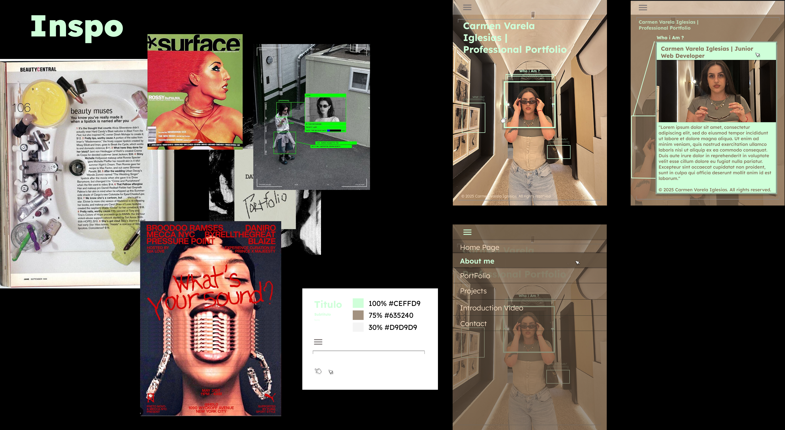

# Professional Portfolio - Carmen Varela Iglesias

Repository for the **Professional Portfolio** project, a website that serves as a professional presentation and showcase for frontend projects.

---

## 📂 Project Description

The **Professional Portfolio** is a web application developed with modern frontend technologies to showcase projects, skills, and contact information in a professional and clear manner.

**Technical objectives:**  
- Apply best practices in HTML, CSS, and JavaScript.  
- Integrate dynamic components with Bootstrap.  
- Maintain a modular and scalable structure, ready for future frontend and backend improvements.

**Current status:**  
The project is **under development**. The full implementation of **Bootstrap** features and **responsive adaptability** is currently pending.

---

## 🛠 Technologies Used

- **Frontend:** HTML5, CSS3, JavaScript ES6+, Bootstrap  
- **Tools:** VS Code, Git, GitHub  
- **Design:** Figma (prototyping and layout)  

---

## ⚙️ Project Structure

portfolio/
│
├── index.html
├── about.html 
├── projects.html 
├── contact.html 
├── css/
│ └── styles.css
├── js/
│ └── main.js 
├── assets/
│ ├── images/ 
│ └── icons/ 
└── README.md 

---

## 🔧 Features

- Professional presentation on the home page.  
- Projects section with dynamic listing and filters.  
- Functional contact form.  
- Responsive design in development.  

---

## 📌 Technical Notes

- Modular and commented code for easy maintenance and scalability.  
- Prepared for future backend integration if required.  
- Application of best practices for accessibility and basic SEO.  

---

## 📄 License

This project is licensed under the [MIT](LICENSE) license.
